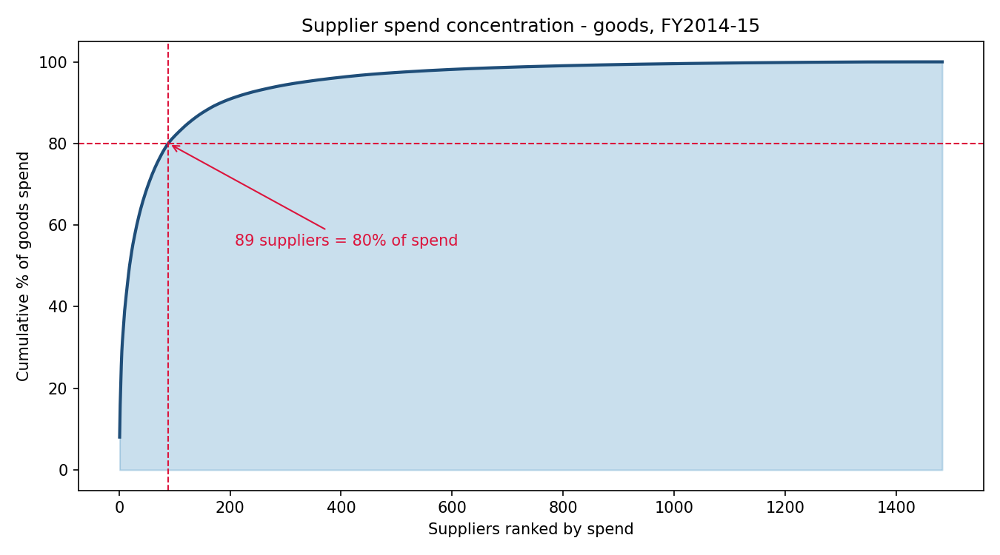
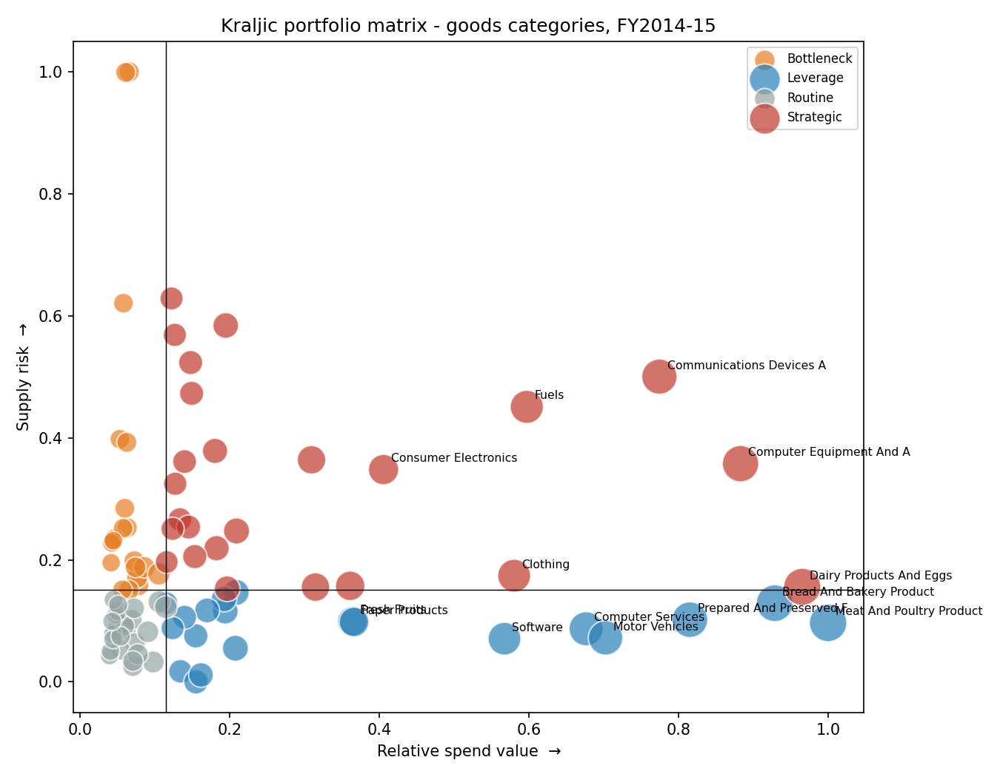

# Procurement Spend Analytics: $3.09B across three California state agencies

Analysis of 39,336 purchase order lines from the California State Contract and
Procurement Registration System (SCPRS), FY2014–15, covering the Department of
Corrections & Rehabilitation, the Department of Water Resources, and Correctional
Health Care Services.

**Identified $24.1M in addressable savings — 4.7% of the $508M transactional goods
portfolio — through supplier consolidation, competitive sourcing and duplicate-payment
controls.**

---

## Headline findings

**1. Spend is extremely concentrated.** 89 of 1,483 goods suppliers (6.0%) account
for 80% of goods spend. The remaining 1,395 suppliers share $102M — an average of
$73,000 each, below the threshold at which supplier relationships pay for their own
administrative cost.

**2. 42.8% of spend bypassed competitive routes.** $1.32B was procured through
non-competitive or exempt methods rather than formal tender or statewide leveraged
agreements. This is the portfolio's single largest governance exposure.

**3. The portfolio is two different businesses.** 1,684 services lines carry $2.58B
(median line $79,709) while 36,458 goods lines carry $508M (median line $1,857). The
ten largest lines alone are 36.7% of total spend. Category-management levers were
therefore scoped to goods, where repeat transactional buying makes consolidation
and price leverage meaningful.

**4. Consolidation is constrained by statute.** Certified Small Business suppliers
hold 33.3% of spend against a 25% mandate; DVBE holds 1.7% against a 3% mandate.
564 of the 1,395 tail suppliers (40%) are SB-certified — so indiscriminate tail
reduction would breach the DVBE target further and erode SB performance.

**5. Data quality is materially compromised.** 785 duplicate purchase lines worth
$27.8M appear within a single fiscal year. 3,906 lines carrying $1.71B are dated
outside the fiscal year they are filed under. 623 lines worth $162M record the
supplier as "Unknown".

---

## What was deliberately *not* claimed

Maverick spend — the same item bought at different prices — is the standard
procurement savings lever and it was tested. It could not be supported by this data.

62% of goods lines record `Quantity = 1` with the entire lot value in `Unit Price`,
while others record true per-unit prices. Across 161 repeat-bought items the median
max/min unit-price ratio is 3,786x; "bread" appears at $0.11 and at $20,747. Unit of
measure is not captured in this dataset vintage, so these ratios reflect inconsistent
data entry, not price variance.

An unfiltered calculation produced $120B in "savings" against a $508M portfolio.
The lever was excluded rather than reported. Quantifying it would require PO-level
data with unit-of-measure captured.

---

## Savings model

| Lever | Saving | Basis | Confidence |
|---|---|---|---|
| Tail-supplier consolidation | $6.13M | 1,395 sub-threshold suppliers, $102M spend, 6% benchmark discount | Medium |
| Route non-competitive goods spend to leveraged contracts | $6.56M | $131M of goods outside competitive routes, 5% improvement | Medium |
| Duplicate purchase-line controls | $13.90M | 785 identical lines worth $27.8M, 50% assumed genuine duplication | Low |
| Maverick spend / price harmonisation | — | Excluded: data does not support it | — |
| **Gross** | **$26.60M** | | |
| Less overlap (levers 1 & 2) | ($2.45M) | 40% haircut, deliberately conservative | |
| **Net identified** | **$24.14M** | 4.7% of addressable goods spend | |

All assumptions are stated. The duplicate-line lever is the largest and the weakest —
it requires PO-level validation to confirm that identical lines represent double
processing rather than legitimate repeat purchases.

---

## Method

1. **Clean** — parse currency fields, remove zero-value lines, deduplicate on
   supplier + item + quantity + price + date + department, audit and flag integrity issues.
2. **Normalise suppliers** — strip legal suffixes and punctuation, then block-and-fuzzy-match
   within name blocks. 2,212 raw name strings resolved to 2,111 supplier identities.
   Guards prevent false merges where digits differ (Reclamation District 108 vs 2085)
   or a distinguishing token conflicts (UC Davis vs UC Irvine). All 8 fuzzy merges
   were manually reviewed; see `02_supplier_merge_log.csv`.
3. **Classify** — using the dataset's own UNSPSC taxonomy (57 segments / 356 families /
   4,968 commodities), present on 99.3% of lines, rather than keyword inference.
4. **Analyse** — Pareto concentration, category fragmentation, price comparability test,
   competitive vs non-competitive sourcing, Kraljic portfolio matrix, diversity-spend participation.
5. **Model savings** — three levers with stated assumptions and an overlap haircut.
6. **Export** — star schema (fact + supplier/category/date dimensions) for BI.

---

## Files

| File | Contents |
|---|---|
| `ca_spend_analysis.py` | Full pipeline, runs end to end |
| `full_analysis_log.txt` | Complete console output |
| `01_data_quality_audit.csv` | Integrity issues found, with line counts and values |
| `02_supplier_merge_log.csv` | Every fuzzy merge, for review |
| `03_pareto_suppliers.csv` | Supplier ranking with cumulative share and tail flag |
| `04_category_fragmentation.csv` | Suppliers, spend and fragmentation index per category |
| `05_price_comparability_test.csv` | Evidence the price lever was rejected |
| `06_sourcing_method.csv` | Spend by acquisition method |
| `07_kraljic.csv` | Category quadrants and recommended strategy |
| `08_savings_model.csv` | Levers, assumptions, confidence |
| `fact_spend.csv`, `dim_*.csv` | Star schema for Power BI / Tableau |
| `chart_1_pareto.png`, `chart_2_kraljic.png`, `chart_3_categories.png` | Charts |

## Data

California Open Data — Purchase Order Data 2012–2015 (SCPRS), purchases over $5,000.
https://data.ca.gov/dataset/purchase-order-data

Scoped to FY2014–15 and the three highest-spend departments.

## Limitations

- Unit of measure is absent, preventing unit-price comparison (see above).
- Purchase order numbers were not retained in the working extract, so duplicate
  detection operates on a business key rather than PO identity.
- Supply risk in the Kraljic matrix is proxied by supplier count and top-supplier
  dependency; it does not incorporate lead time, substitutability or market structure.
- Savings percentages are benchmark-based and directional, not negotiated outcomes.
- The publisher notes that where a purchase order carried multiple UNSPSC codes, only
  the first was retained.
